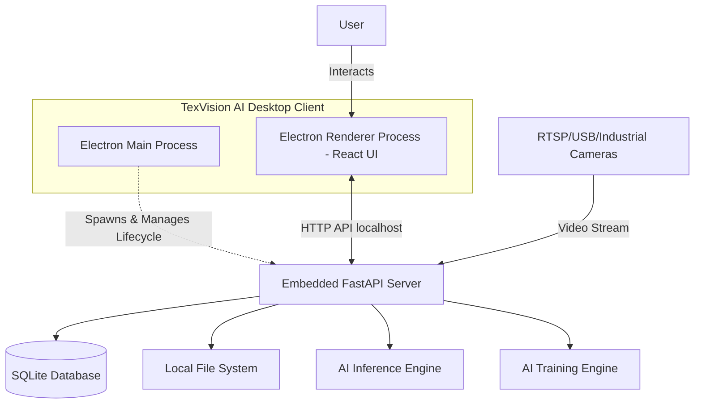
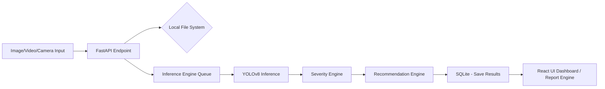
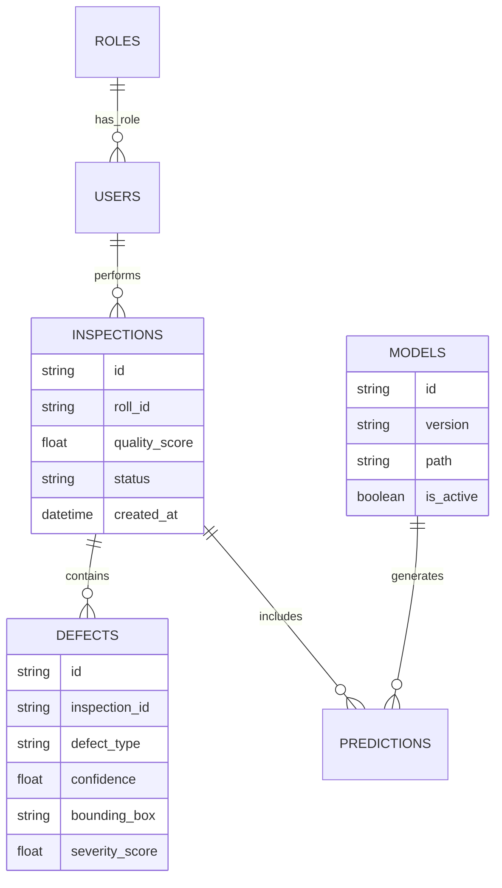

# TexVision AI - System Architecture Document (Desktop Revision)

> [!NOTE]
> This document outlines the revised architectural design for the TexVision AI standalone desktop application. Please review the architecture and provide your approval to proceed with the next phases.

---

## 1. Functional Requirements

*   **Offline Operation:** The application must operate fully offline by default. Internet connectivity is only required for optional updates, cloud synchronization, or future enterprise features.
*   **Defect Detection & Classification:** Detect, classify, and localize defects (e.g., Hole, Broken Yarn, Oil Stain) from images, videos, and live camera feeds using YOLO.
*   **Severity Engine:** Compute a Severity Score and Quality Score (0-100) based on bounding box area, confidence, defect type, critical weights, and fabric dimensions.
*   **Recommendation Engine:** Provide actionable outputs (e.g., Repair, Reject, Re-inspect, Machine Maintenance).
*   **Dataset Engine:** Import diverse dataset formats, verify labels, remove duplicates, generate `data.yaml`, and split datasets locally.
*   **AI Training & Versioning:** Train, validate, test, and resume training for AI models locally. Save checkpoints and version models on the host machine.
*   **Inference APIs:** Support Single Image, Batch, Folder, Video, and various Camera streams (Webcam, RTSP, USB, Industrial).
*   **Reporting:** Generate PDF reports containing images, bounding boxes, statistics, scores, and recommendations.
*   **User & Role Management:** Manage local user profiles and permissions within the app.
*   **Dashboard & Analytics:** View local inspection histories, trends, quality averages, defect heatmaps, and charts.

## 2. Non-functional Requirements

*   **Standalone Executable:** The application must be easily installable via a single desktop executable (e.g., `TexVisionAI.exe`).
*   **Performance:** Real-time inference for live cameras utilizing local GPU acceleration (TensorRT/ONNX) if available, with automatic CPU fallback.
*   **Resource Management:** The desktop shell must cleanly manage the lifecycle of the embedded AI backend, ensuring no zombie Python processes remain after the app closes.
*   **Security:** Local data encryption where necessary, safe execution of local processes, and protection against local injection vectors.
*   **Maintainability:** Code must adhere to PEP8, SOLID principles, Clean Architecture, and utilize Type Hints and Docstrings.

---

## 3. Complete System Architecture

The system transitions from a cloud microservices model to a **Local Desktop Application Architecture**. It uses Electron as the host shell, which serves a React frontend and manages an embedded Python/FastAPI backend process.

*   **Design Decision:** Electron Desktop Shell + Embedded FastAPI
    *   **Why:** Provides a native application feel (`TexVisionAI.exe`) with full offline capabilities, while allowing the UI to be built with modern web tech (React/Tailwind) and the heavy lifting to be done in Python (PyTorch/FastAPI).
    *   **Alternatives:** Qt (PyQt/PySide), Tauri, Tkinter.
    *   **Advantages:** Huge ecosystem, cross-platform potential, reuses web development skills.
    *   **Drawbacks:** Higher RAM usage due to the embedded Chromium instance.

## 4. High-Level Component Diagram



## 5. Data Flow Diagram



## 6. AI Pipeline Architecture

The AI Pipeline (Training, Validation, Inference) remains Python-based (PyTorch + Ultralytics YOLO). The models are stored locally on the user's file system, avoiding any dependency on cloud registries.

*   **Design Decision:** Local Model Storage & Execution
    *   **Why:** Ensures zero latency for network trips, crucial for real-time factory camera processing.
    *   **Advantages:** Completely offline, no ongoing cloud computing costs.
    *   **Drawbacks:** The local hardware (factory PC) must be powerful enough to handle inference and training.

## 7. Backend Architecture

*   **Design Decision:** FastAPI (Python) running on `localhost`
    *   **Why:** Retains high performance and async capabilities. Easily packaged with PyInstaller to run seamlessly alongside Electron.
    *   **Alternatives:** Node.js backend with Python child processes.
    *   **Advantages:** API architecture remains clean; if enterprise cloud features are needed later, the backend code requires minimal refactoring.

## 8. Frontend Architecture

*   **Design Decision:** React + TypeScript + Vite + TailwindCSS + Electron
    *   **Why:** Vite builds the React app incredibly fast. Electron wraps the Vite output into a desktop window.
    *   **Advantages:** Familiar, component-driven UI development.
    *   **Drawbacks:** Electron Inter-Process Communication (IPC) requires careful security configurations.

## 9. Database Architecture (ER Diagram)



*   **Design Decision:** SQLite as default local database.
    *   **Why:** Serverless, zero-configuration database that lives in a single file on the local disk. Perfect for offline desktop apps.
    *   **Alternatives:** Local PostgreSQL instance.
    *   **Advantages:** No database installation required for the user. Highly portable.
    *   **Drawbacks:** Lower concurrency limit than Postgres (but sufficient for a single-user desktop app).
    *   **Future-Proofing:** SQLAlchemy ORM will be used, allowing seamless switching to PostgreSQL for future enterprise (multi-client) deployments.

## 10. Deployment Architecture

```mermaid
graph TD
    subgraph Build Pipeline (CI/CD / Dev)
        Code[Source Code]
        Docker[Docker for Dev/Testing]
        PyInstaller[PyInstaller builds FastAPI .exe]
        Vite[Vite builds React static files]
        ElectronBuilder[Electron Builder packages everything]
    end
    
    PyInstaller --> ElectronBuilder
    Vite --> ElectronBuilder
    ElectronBuilder --> Installer[TexVisionAI Setup.exe]
    
    subgraph Factory PC (Target)
        Installer --> InstallDir[C:\Program Files\TexVision AI]
        InstallDir --> AppData[C:\Users\User\AppData\Roaming\TexVisionAI]
        AppData -.-> DB[(SQLite DB)]
        AppData -.-> Storage[Local Models & Images]
    end
```

*   **Design Decision:** Electron Builder + PyInstaller
    *   **Why:** PyInstaller bundles Python, FastAPI, PyTorch, and YOLO into a standalone binary. Electron Builder wraps that binary and the React frontend into a standard Windows Installer (`.exe`).
    *   **Alternatives:** Distributing as a Python package, Docker on Windows.
    *   **Advantages:** The end-user double-clicks an installer; no technical setup (no Docker, no Python installation) is required. Docker is retained strictly for developer consistency and CI/CD pipelines.

## 11. Folder Structure

```text
texvision-ai/
├── electron/             # Electron Main Process & Preload scripts
├── frontend/             # React, Vite, Tailwind, TS (Renderer Process)
├── backend/              # FastAPI, Pydantic, SQLAlchemy
│   ├── api/              # REST endpoints
│   ├── core/             # Config, security, DB connection
│   └── services/         # Business logic
├── ai/
│   ├── training/         # YOLO training scripts
│   ├── inference/        # ONNX/TensorRT inference engines
│   └── dataset_builder/  # Dataset parsing, validation
├── database/             # Alembic migrations, SQLite DB file path configs
├── docker/               # Dev/Test Dockerfiles ONLY
├── scripts/              # Build scripts (PyInstaller, Electron Builder)
├── config/               # App configs, SQLite paths
├── reports/              # PDF generation templates
├── tests/                # Pytest, Jest
├── docs/                 # Architecture, API docs
├── models/               # Local Model registry structure
├── weights/              # Local Saved .pt / .onnx files
├── uploads/              # Local Image/Video storage (AppData)
└── logs/                 # Local File Logging
```

## 12. Storage Architecture

*   **Design Decision:** Local File Storage
    *   **Why:** Eliminates the overhead of running MinIO or S3 locally. Images, datasets, and models are saved directly to the OS file system (e.g., `AppData` on Windows).
    *   **Advantages:** Faster local read/write, simple backup by copying folders.
    *   **Future-Proofing:** Abstracted storage layer in Python, allowing S3/MinIO to be injected later for cloud synchronization.

## 13. Authentication Architecture

*   **Design Decision:** Local App Authentication
    *   **Why:** Since the app runs locally on a factory PC, authentication is meant to prevent unauthorized local operators from accessing admin settings (e.g., deleting models).
    *   **Mechanism:** Simple PIN or local password login. JWT is still generated by FastAPI for API security, ensuring the React UI communicates securely with the local backend.
    *   **Advantages:** Works completely offline.

## 14. Technology Stack Summary

*   **Desktop Shell:** Electron (JavaScript/Node.js)
*   **Frontend UI:** React, TypeScript, Vite, TailwindCSS, React Query
*   **Backend Server:** FastAPI, Python, Uvicorn (embedded)
*   **AI Engine:** PyTorch, Ultralytics YOLO, OpenCV, TensorRT/ONNX
*   **Database:** SQLite (SQLAlchemy ORM)
*   **Storage:** Local File System (OS Native)
*   **Packaging:** Electron Builder + PyInstaller
