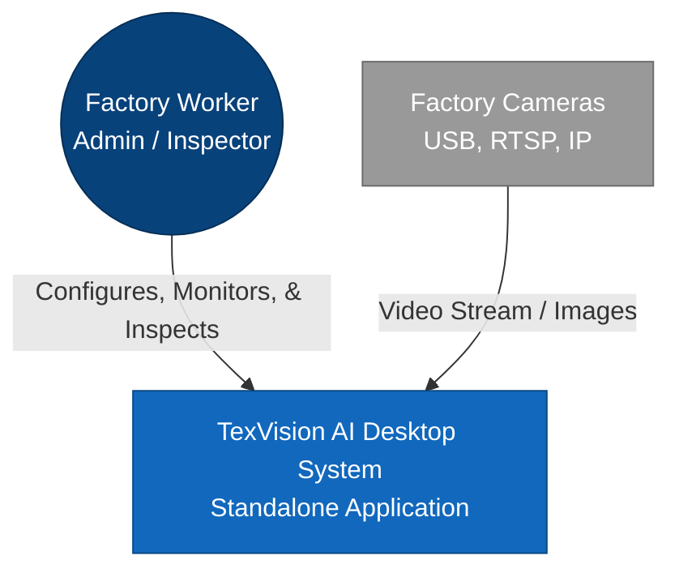
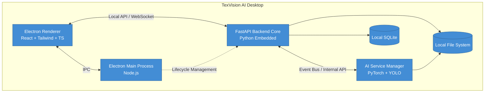
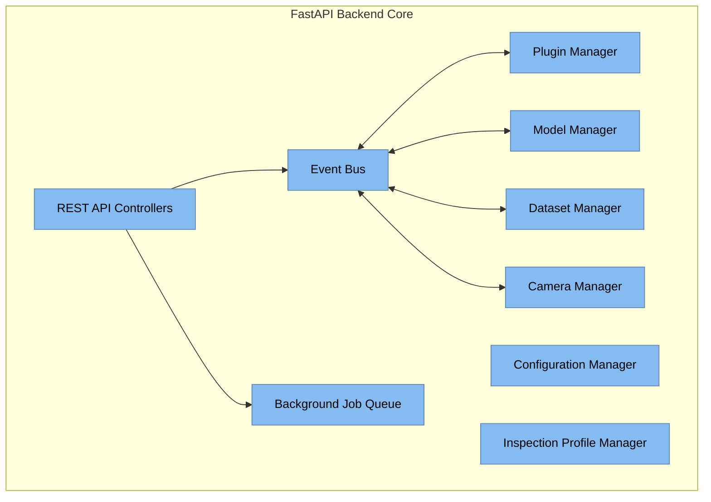
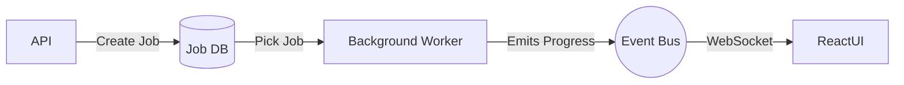
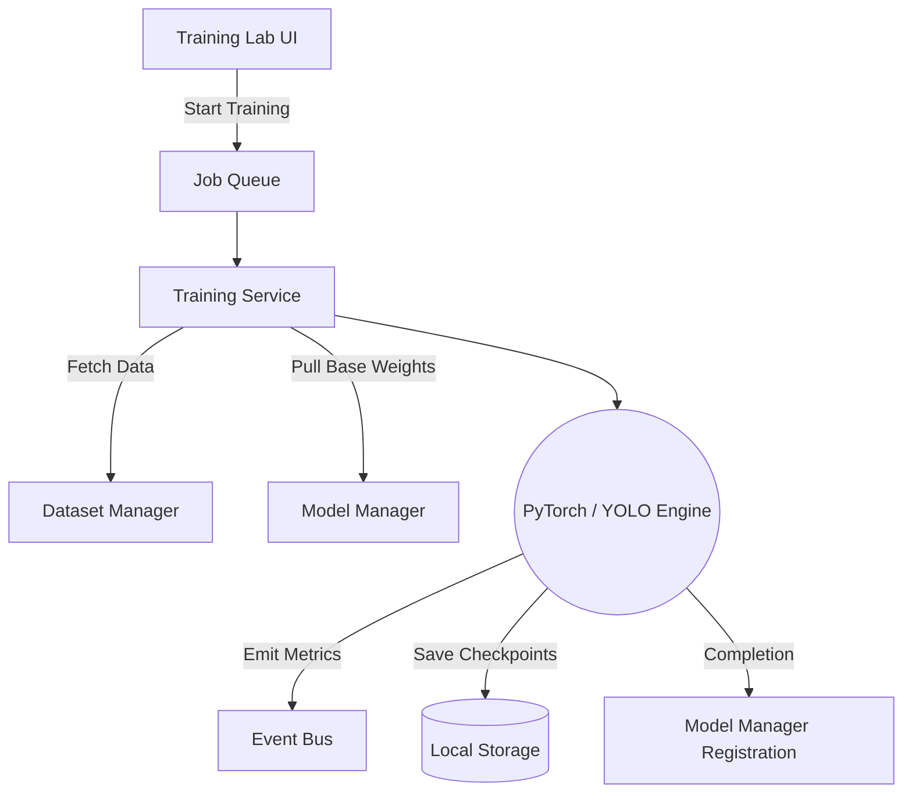
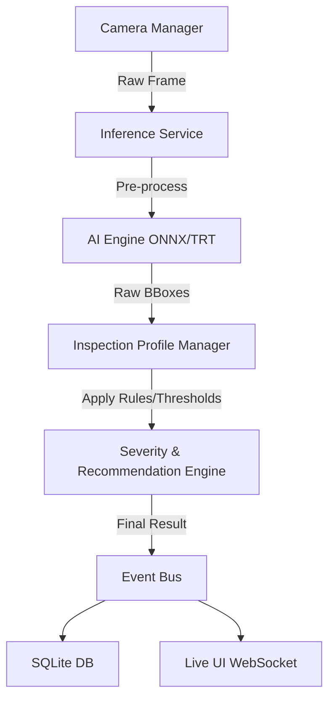

# TexVision AI - Enterprise Architecture Document (Version 2)

> [!NOTE]
> This document outlines the Version 2 enterprise-grade architectural design for the TexVision AI standalone desktop application. It employs the C4 Model approach alongside Mermaid diagrams for comprehensive architectural clarity. Please review and provide your approval to proceed.

---

## 1. System Architecture (C4 Model)

The architecture follows the C4 model to describe the system at varying levels of abstraction.

### 1.1 Context Diagram (Level 1)



### 1.2 Container Diagram (Level 2)



### 1.3 Component Diagram (Level 3 - Backend Core)



---

## 2. Application Workspaces

To support a professional industrial workflow, the React frontend is divided into distinct workspaces, avoiding a cluttered single dashboard.

*   **Dashboard:** High-level overview, factory statistics, quick actions.
*   **Inspection Workspace:** Live camera feeds, manual image uploads, real-time defect bounding boxes, severity scores, and recommendations.
*   **Dataset Manager:** Import, validate, merge, and split datasets. View class balance and image quality analytics.
*   **Training Lab:** Configure hyper-parameters, start/stop jobs, view real-time TensorBoard metrics.
*   **Model Manager:** Registry of all YOLO models. Compare mAP, precision, recall. Set active models and rollback.
*   **Analytics:** Deep dive into historical defect trends and production quality over time.
*   **Reports:** Generate, view, and export PDF inspection reports.
*   **Camera Center:** Discover, connect, calibrate, and monitor health for RTSP/USB/IP cameras.
*   **Settings:** Access Configuration Manager profiles.
*   **Administration:** User roles, local RBAC, audit logs.

---

## 3. Core Architectural Components (Design Decisions)

### 3.1 AI Service Manager

The AI Service Manager decouples AI logic from the web server layer.

*   **Purpose:** Act as an orchestrator for all AI operations.
*   **Responsibilities:** Expose unified internal APIs to FastAPI. Manage lifecycles of Inference, Training, Dataset, Evaluation, and Export Services.
*   **Advantages:** Huge improvement in scalability. If the app is later moved to the cloud, the AI Service Manager can easily be extracted into its own container/microservice. Prevents AI memory leaks from crashing the API.
*   **Drawbacks:** Adds a layer of indirection (RPC or internal HTTP) between API and AI.
*   **Alternative Designs:** Tightly coupling PyTorch objects into FastAPI request handlers (rejected due to memory and blocking I/O issues).

### 3.2 Background Job System

*   **Purpose:** Handle long-running operations without blocking the application.
*   **Responsibilities:** Manage jobs (Training, Export, PDF Generation, Batch Prediction) across states: *Queued, Running, Paused, Cancelled, Completed, Failed*. Track Progress % and ETA.
*   **Advantages:** UI remains perfectly responsive. Users can queue multiple dataset imports or training runs.
*   **Drawbacks:** Requires persistent queue storage (SQLite/Local Redis) and worker pool management.
*   **Workflow:** User triggers action -> API creates Job ID in DB -> Job Queue assigns to Worker -> Worker emits progress events via Event Bus -> UI updates via WebSocket.



### 3.3 Event Bus

*   **Purpose:** Decouple module communication using a Publish/Subscribe pattern.
*   **Events:** `PredictionCompleted`, `TrainingStarted`, `TrainingFinished`, `DatasetImported`, `ModelActivated`, `ReportGenerated`, `UserLoggedIn`, `CameraConnected`, `CameraDisconnected`.
*   **Advantages:** Modules don't need to know about each other. The Plugin Architecture can simply listen to events to add functionality.
*   **Alternative Designs:** Direct function calls / tight coupling (rejected due to spaghetti code risk).

### 3.4 Plugin Architecture

*   **Purpose:** Make TexVision AI modular and extensible for different industries.
*   **Responsibilities:** Load isolated plugins (e.g., Fabric, Leather, Metal inspection logic). Handle Plugin Manifests, versioning, and discovery.
*   **Advantages:** Core codebase remains pristine. Third-party integrators can write plugins for proprietary cameras or ERP systems.
*   **Drawbacks:** Requires a strict interface definition and sandboxing to prevent plugins from crashing the main app.

### 3.5 Model Manager

*   **Purpose:** A dedicated registry for AI Models.
*   **Responsibilities:** Manage Model Versioning, set the Active Model, support rollbacks. Store metadata (mAP, Precision, Recall, Author, Date, Hyperparameters). Handle export/import (ONNX, TensorRT, TorchScript).
*   **Advantages:** Full traceability for AI performance. Quality inspectors know exactly which model version flagged a defect.

### 3.6 Dataset Manager

*   **Purpose:** Comprehensive handling of training data.
*   **Responsibilities:** Dataset versioning, import/export, merge/split. Validation (Duplicate detection, corrupted images, class balance stats).
*   **Advantages:** Garbage-in, garbage-out. The Dataset Manager ensures only high-quality data reaches the Training Lab.

### 3.7 Inspection Profile Manager

*   **Purpose:** Factories inspect different materials using different rules.
*   **Responsibilities:** Manage profiles (e.g., Cotton vs Denim). Each profile stores Confidence Thresholds, Severity Rules, Acceptance Rules, Quality Formulas, Preferred Models, and Camera/Lighting configs.
*   **Advantages:** One-click switching between production lines.

### 3.8 Camera Manager

*   **Purpose:** Abstract hardware complexity.
*   **Responsibilities:** Handle USB, RTSP, IP, and Industrial cameras. Manage live preview, calibration, resolution/FPS selection. Provide Automatic Reconnection and Health Monitoring.
*   **Advantages:** The Inference engine doesn't care where the image comes from. High reliability via auto-reconnect.

### 3.9 Configuration Manager

*   **Purpose:** Centralized, schema-validated settings.
*   **Responsibilities:** Manage GPU/CPU threads, storage paths, report templates, security settings, and logging levels.
*   **Advantages:** Avoids scattered `.env` or JSON files.

---

## 4. Detailed Pipeline Diagrams

### 4.1 Training Pipeline



### 4.2 Inference Pipeline



---

## 5. Structured Local Storage Architecture

The generic storage is replaced with a highly structured local AppData directory tree:

```text
%AppData%/TexVisionAI/
├── datasets/          # Versioned, processed datasets ready for training
├── models/            # Native .pt and registered models
├── weights/           # Base weights for transfer learning
├── reports/           # Generated PDF and CSV reports
├── images/            # Saved defect snapshots for traceability
├── videos/            # Short clip recordings of continuous defects
├── exports/           # ONNX/TensorRT compiled models
├── cache/             # Temporary processing files
├── logs/              # Structured JSON logs for all services
├── plugins/           # Dynamically loaded third-party modules
├── backups/           # SQLite DB automated backups
├── temp/              # Upload chunks before assembly
├── training_runs/     # TensorBoard logs and intermediate checkpoints
└── evaluation/        # Validation output visualizations (confusion matrices)
```
*   **Why:** Complete segregation of data types ensures fast disk I/O, easy targeted backups, and prevents directory traversal vulnerabilities.

---

## 6. AI Module Structure (Code-Level)

The Python source code for the AI subsystem is organized for enterprise maintainability:

```text
ai/
├── core/             # Base classes, interfaces, configuration loaders
├── training/         # YOLO training orchestrators, augmentations
├── inference/        # TensorRT/ONNX runtime wrappers, batch processors
├── dataset/          # Parsers (COCO, VOC, YOLO), validators, splitters
├── evaluation/       # Metrics calculation (mAP, F1), matrix generation
├── exports/          # Conversion scripts (.pt to ONNX/TRT)
├── plugins/          # Built-in AI plugins (Fabric vs Leather logic)
├── models/           # Model Registry database adapters
├── pipelines/        # End-to-end DAGs tying inference to severity rules
└── utils/            # GPU memory management, logging, math helpers
```

---

## 7. Future Roadmap

To ensure TexVision AI remains a scalable enterprise solution for years to come, the architecture supports the following expansion paths:

*   **Cloud Synchronization:** Optional syncing of local SQLite data and critical defect images to an Enterprise AWS/Azure Cloud.
*   **Multi-Factory Management:** A central SaaS dashboard aggregating metrics from dozens of offline desktop nodes globally.
*   **Model & Plugin Marketplace:** Allow third parties to sell specialized models (e.g., "Medical Grade Non-woven Fabric Defect Model") directly inside the app.
*   **Federated Learning:** Train models collaboratively across factories without sharing raw proprietary images.
*   **Auto Retraining:** Configurable pipelines that automatically fine-tune the model overnight using images flagged by operators during the day.
*   **Industrial IoT & MES Integration:** Event Bus plugins to signal PLCs via OPC-UA to stop the loom when a critical defect is detected.
*   **Digital Twin:** Mapping defect locations onto a virtual 3D roll of fabric for exact downstream cutting optimization.
*   **Edge AI:** Deploying the inference service directly to NVIDIA Jetson devices attached to the cameras, communicating back to the Desktop app.
